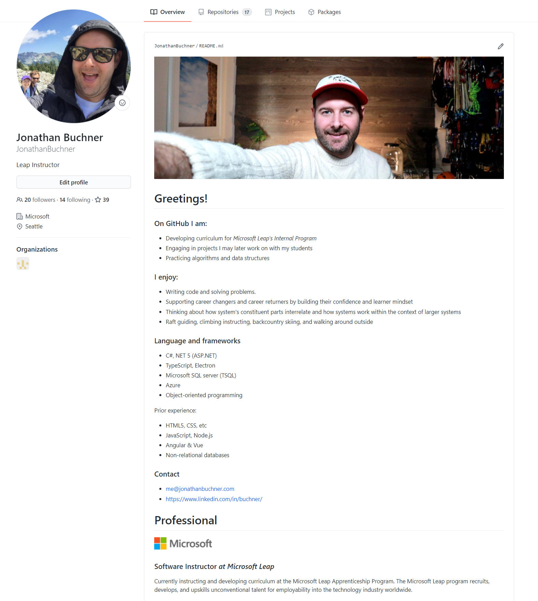
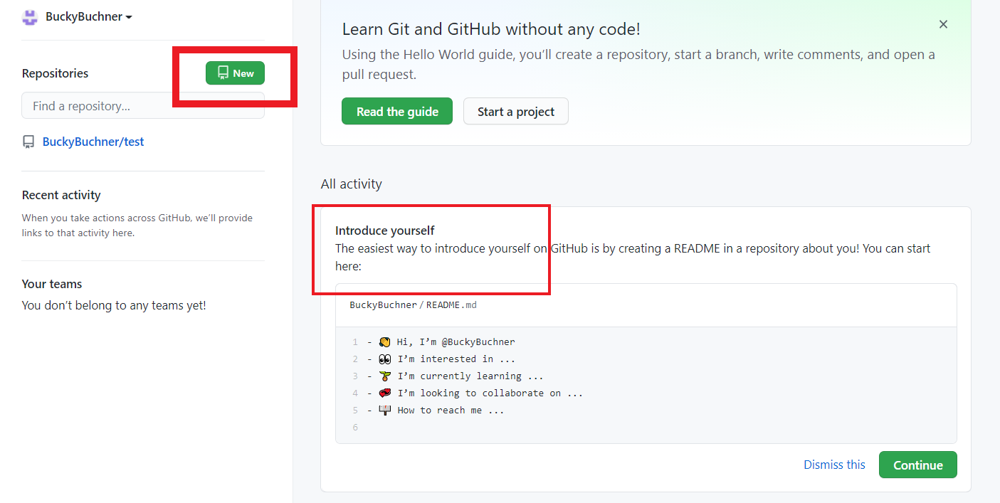
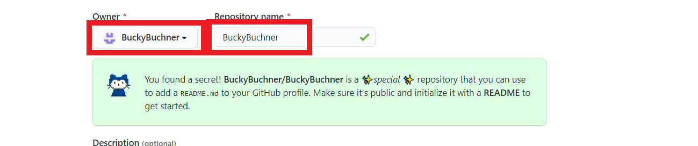
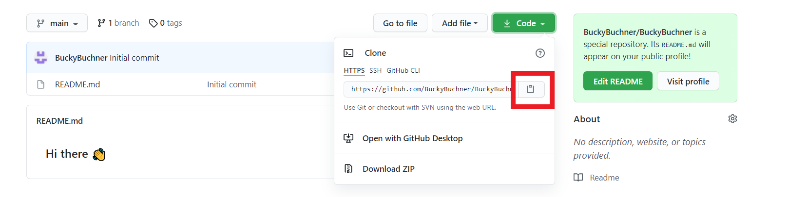
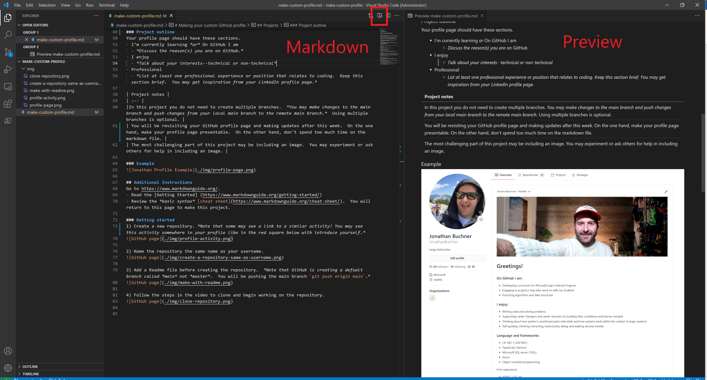

#  Making your custom GitHub profile

## Summary
Make a custom GitHub profile.

## Estimated time
The estimated time is 2 to 4 hours.
- 25m reading documentation
- 1.5h to 3.5h making the custom profile

## Resources
*Documentation* - [Markdown Guide](https://www.markdownguide.org/)
- [Getting Started](https://www.markdownguide.org/getting-started/) page
- [Cheat sheet](https://www.markdownguide.org/cheat-sheet/) page

## Projects
This may be your first Leap project.  Projects utilize the learning in lessons, but you have freedom to drive the project and make it your own. You will need to demonstrate the competencies and follow all project requirements.

Requirements represent the minimum requirements, but you are not limited by project requirements. *e.g. below it says *use four headings tags, you may use more than four head tags. You also may use any markdown syntax compatible with GitHub, not just basic syntax listed below.*

To complete this project you will want to visit https://www.markdownguide.org/.  You will
- Read the [Getting Started](https://www.markdownguide.org/getting-started/) page
- Review the *basic syntax* [cheat sheet](https://www.markdownguide.org/cheat-sheet/) page

### Cheating
For many projects, including this one, students are encouraged to help each other.  Cheating, however, is not tolerated.  For this project: 
- Looking at someone else's code for inspiration is not cheating for this project
- Copying and pasting others code is not acceptable

| Project competencies |
| :-- |
| Demonstrate comprehension of markdown syntax through implementing all project requirements |
| Learn through reading documentation (*in this case, reading markdown documentation*)  |
| Clone and manage a local git repository |
| Make commits with atomic commit messages |
| Push changes to remote repository |

| Project requirement |
| :-- |
|Make a minimum of four commits (*Recommend making at least one commit for each profile section*).|
| Use four heading tags (Hint: `# Creates an H1 heading`). | 
| Have bold text |
| Have italic text |
| Make a list |
| Add a link to your LinkedIn profile |
| Add an image (*The image may be of anything--your cat, an icon, etc.*). |
  
### Project outline
Your profile page should have these sections.
- I’m currently learning *or* On GitHub I am
  - *Discuss the reason(s) you are on GitHub.*
- I enjoy
  - *Talk about your interests--technical or non-technical*
- Professional
  - *List at least one professional experience or position that relates to coding.  Keep this section brief.  You may get inspiration from your LinkedIn profile page.* 

| Project notes |
| :-- |
|In this project you do not need to create multiple branches.  *You may make changes to the main branch and push changes from your local main branch to the remote main branch.*  Using multiple branches is optional. |
| You will be revisiting your GitHub profile page and making updates after this week.  On the one hand, make your profile page presentable.  On the other hand, don't spend too much time on the markdown file. |
| The most challenging part of this project may be including an image.  You may experiment or ask others for help in including an image. |

### Example

## Additional Instructions
Go to https://www.markdownguide.org/.  
- Read the [Getting Started](https://www.markdownguide.org/getting-started/)
- Review the *basic syntax* [cheat sheet](https://www.markdownguide.org/cheat-sheet/).  You will return to this page to make this project.

### Getting started
1) Create a new repository. *Note that some may see a link to a similar activity! You may see this activity somewhere in your profile like in the red square below with introduce yourself.*

2) Name the repository the same name as your username. 

3) Add a Readme file before creating the repository.  *Note that GitHub is creating a defualt branch called *main* not *master*.  You will be pushing the main branch `git push origin main`.*

4) Follow the steps in the video to clone and begin working on the repository.

5) After cloning the repository, open it in VS code.  When opening a markdown file in VS code, there is a *preview markdown* button at the top right corner.  This allows you to preview the markdown output.  *On the left is th markdown file. On the right is the preview of the markdown output.*

